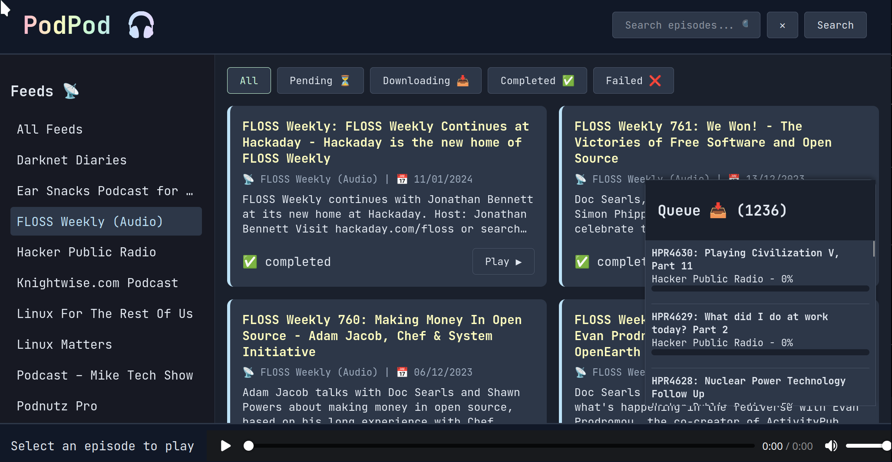

# PodPod

A simple tool to download and play podcast feeds.



## Prerequisites

- Node.js (v18+)
- npm

## Setup

1. Clone the repository.
2. Run the installation script:
   ```bash
   chmod +x install.sh
   ./install.sh
   ```

## Usage

To start the application:

```bash
./start.sh
```

The application will initialize the database if it doesn't exist and start the server. If `feed.opml` exists this populates the initial set of feeds.

## Add a feed

```
./add-feed.js {feed-url}
```
